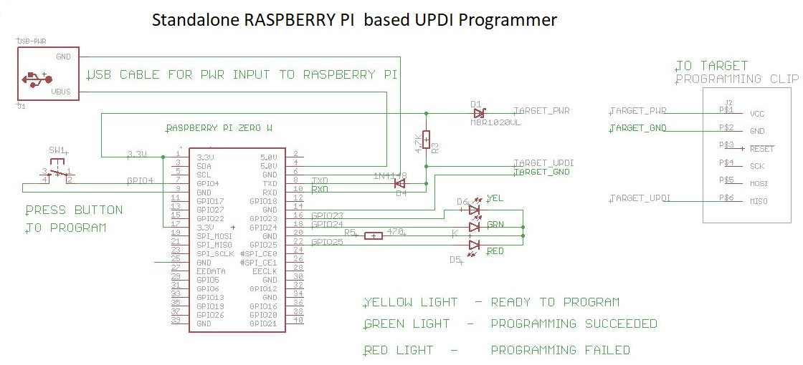

# pyupdi

PYUPDI Adaptation for Raspberry PI Zero W

Usage:

0.  Power-up the Raspberry PI Programmer (USB Power connection)
1.  Raspberry PI Programmer can provide power to Target board.  Whether or not target board has separate power is irrelevant to programming.
2.  Programmer has WiFi.  Use WINSCP to login to Programmer and place hex file in programming directory.
3.  Reboot the Programmer.  Within 30 seconds, Yellow comes on - Ready for Use.
4.  Press Program button to program.  Within 10-15 seconds, Green light will lit - signals programming success.  If Red light lit - signals programming failed.

Python UPDI driver for programming "new" tinyAVR and megaAVR devices

pyupdi is a Python utility for programming AVR devices with UPDI interface
  using a standard TTL serial port.

  Connect RX and TX together with a suitable resistor and connect this node
  to the UPDI pin of the AVR device.

  Be sure to connect a common ground, and use a TTL serial adapter running at
   the same voltage as the AVR device.

<pre>
                        Vcc                     Vcc
                        +-+                     +-+
                         |                       |
 +---------------------+ |                       | +--------------------+
 | Serial port         +-+                       +-+  AVR device        |
 |                     |      +----------+         |                    |
 |                  TX +------+   4k7    +---------+ UPDI               |
 |                     |      +----------+    |    |                    |
 |                     |                      |    |                    |
 |                  RX +----------------------+    |                    |
 |                     |                           |                    |
 |                     +--+                     +--+                    |
 +---------------------+  |                     |  +--------------------+
                         +-+                   +-+
                         GND                   GND

</pre>
When running pyupdi on Raspberry pi, use GPIOs 14 and 15 for UART TX and RX.
On rpi3, be sure to apply the device tree overlay to map UART0/ttyAMA0 to these pins (relocate or disable Bluetooth device).
More information here: https://www.raspberrypi.org/documentation/configuration/uart.md
